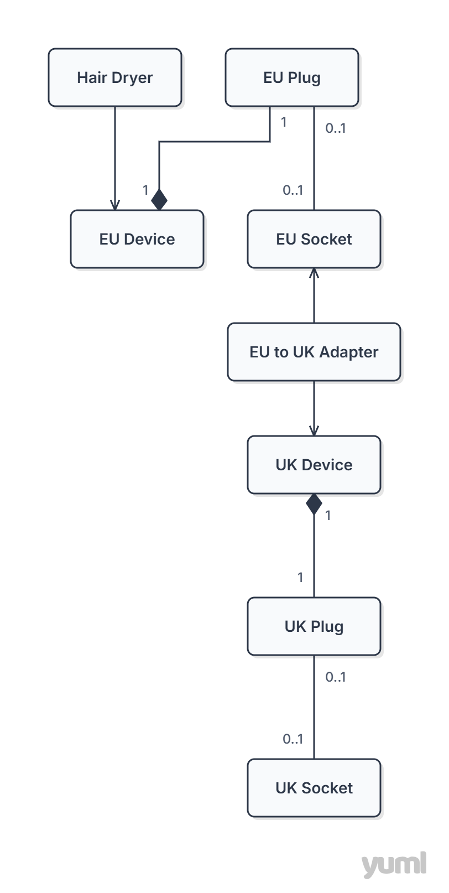

# Lab Hairdryer — Adapter Design Pattern

Solution to a **Software Engineering Fundamentals** laboratory exercise
on implementing the *Adapter* design pattern based on a UML class
diagram.

Krysia is travelling to Inverness for a concert and needs a power
adapter to plug her European hairdryer into a British socket. This
project models the problem and implements the adapter as a
`UKSocketAdapter` class.

## Task 3.1 — Class Diagram

UML class diagram modelling the adapter, the hairdryer, and the
collaborating elements (sockets, plugs, devices):



## Task 3.2 — Implementation

The solution consists of:

- the `edu.kis.pio.triptouk.UKSocketAdapter` class — an adapter
  implementation that simultaneously realises the `IUKDevice`
  interface (a device with a UK plug) and the `IEuropeanSocket`
  interface (a European socket from the connected device's
  point of view),
- the implementation of
  `SocketProblemHelper.plugEuropeanDeviceIntoUKSocket`, which
  creates an adapter instance and connects the device to the socket
  through it.

## Running the Tests

The project is a Maven project. It requires JDK 8 or newer.

```bash
mvn test
```

Or from an IDE: run the `edu.kis.pio.tests.HairDryerStoriesTest`
class as a JUnit test. All four scenarios (hairdryer in
Poland / UK, plugged into a 230 V / 400 V socket) should pass.

## Lab Instructions

The full lab instructions are available here:
[docs/lab-instructions.pdf](docs/lab-instruction.pdf)

## Base Project Source

The base project structure comes from the
[iis-io-team/lab_hairdryer](https://github.com/iis-io-team/lab_hairdryer)
repository.